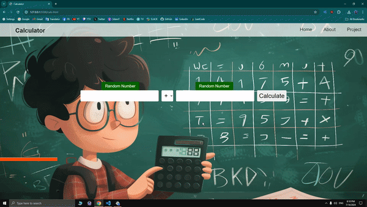
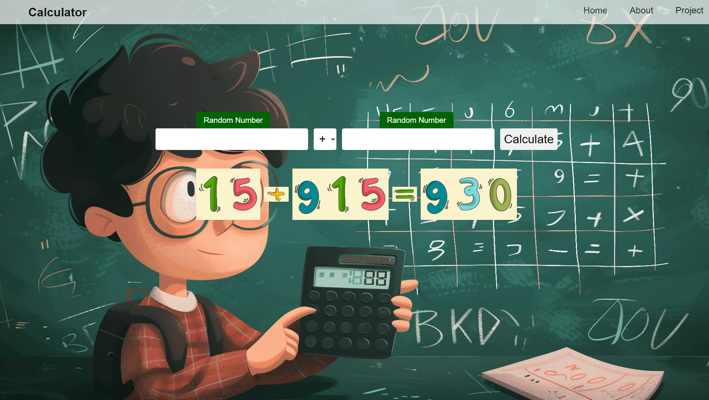
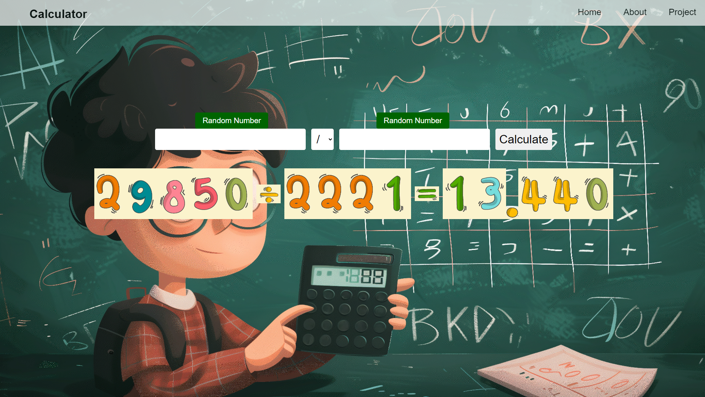

# calc-app

# About

### Calculator website for 4th graders

- HTML, CSS and JavaScript project for a client.
- A calculator website where the inputs and result are turned into images when you calculate.
- You can use the four operators : addition, subtraction, multiplication and division.
- You can also put random values in the inputs.
- Each operator has an exam page.

# THIS PREVIEW IS OLD , MORE PAGES ADDED

# Preview

